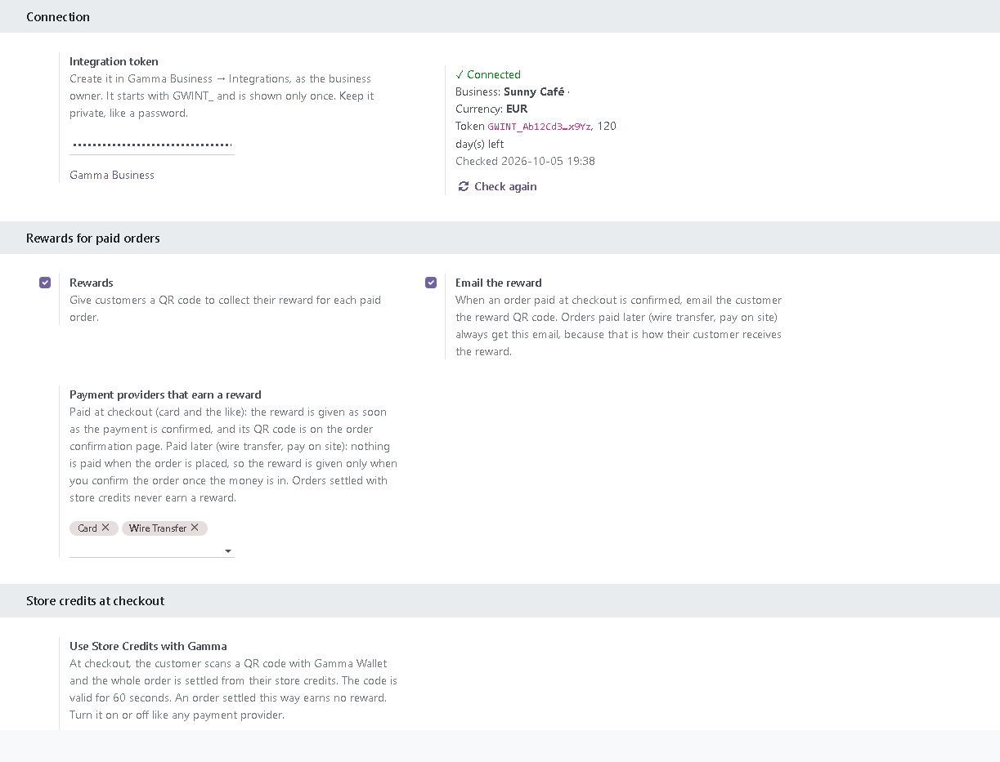
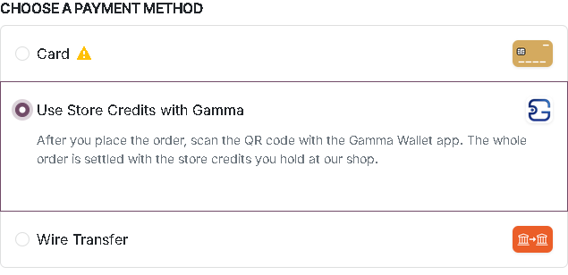
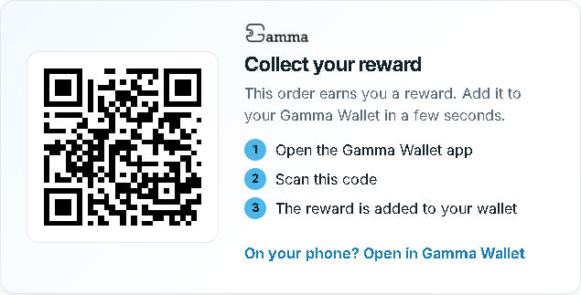
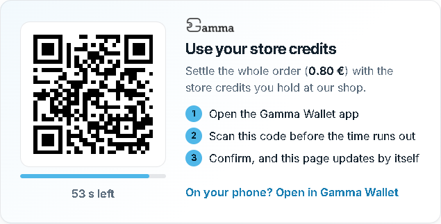
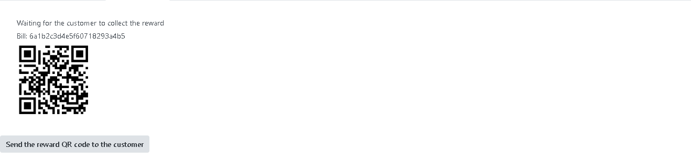

# Gamma Wallet for Odoo

Use [Gamma Wallet](https://www.gamma-wallet.com) in your Odoo eCommerce shop. Once the module is installed:

- **Your customers earn a reward for every paid order.** After paying, they scan a QR code with the Gamma Wallet app and the reward is added to their wallet, under your business.
- **Your customers can use the store credits they hold at your shop.** At checkout they choose *Use Store Credits with Gamma*, scan a QR code, and the whole order is settled from their credits.

Credits are a promise of value at your business. They are not money and not crypto, and Gamma never handles any payment. Card payments, wire transfer and the rest keep working exactly as they do today.

This guide is for shop owners and the Odoo partners who install modules for them. If you want to connect your own software instead of Odoo, see [byCode](https://github.com/Gamma-Wallet/Integrations-samples-/tree/main/byCode).

---

## Contents

1. [What you need](#1-what-you-need)
2. [Install the module](#2-install-the-module)
3. [Create your integration token in Gamma Business](#3-create-your-integration-token-in-gamma-business)
4. [Connect your shop](#4-connect-your-shop)
5. [Choose which orders earn a reward](#5-choose-which-orders-earn-a-reward)
6. [Store credits at checkout](#6-store-credits-at-checkout)
7. [What your customers see](#7-what-your-customers-see)
8. [Your orders](#8-your-orders)
9. [Renewing your token](#9-renewing-your-token)
10. [Questions and answers](#10-questions-and-answers)
11. [When something is wrong](#11-when-something-is-wrong)

---

## 1. What you need

| | |
|---|---|
| A Gamma Business account with a **Reward** service active | [Register](https://business.gamma-wallet.com) and start on the free tier, then activate a Reward service. The module works only with a Reward service: while another kind of service is active (a membership or a discount card, for example), customers get no reward QR code and store credits are not offered at checkout. |
| **Odoo 18**, self-hosted or on Odoo.sh | Community or Enterprise edition, with the **Website** and **eCommerce** apps. **Odoo Online** (Odoo's own cloud, *yourshop.odoo.com*) does not allow modules from outside Odoo, so the module cannot be installed there. |
| The same currency | Your shop must sell in the same currency as your Gamma business (for example EUR in both). |

Versions for Odoo 19 and 20 will follow; each Odoo version needs its own copy of the module.

## 2. Install the module

Usually your Odoo partner (the company that set up your Odoo) does this.

1. Download **[gamma_wallet.zip](gamma_wallet.zip)** (on GitHub, open the file and click *Download raw file*) and unzip it. You get a folder named `gamma_wallet`.
2. Put that folder in your Odoo addons directory. On **Odoo.sh**, add it to your project's git repository like any other module.
3. Restart Odoo.
4. Turn on developer mode (*Settings → Activate the developer mode*), then go to **Apps → Update Apps List**.
5. Search for **Gamma Wallet** in Apps and click **Activate**.

## 3. Create your integration token in Gamma Business

The token is the key that lets your shop talk to your Gamma business. You never give the module your password.

1. Sign in to [Gamma Business](https://business.gamma-wallet.com) as the business owner.
2. Open **Integrations**.
3. Click **Create token** and choose how long it stays valid (up to one year).
4. **Copy the token now.** It starts with `GWINT_` and is shown only once.

Keep the token private, like a password. Anyone who has it can create rewards for your business. If you think it has leaked, disable it in **Integrations** and create a new one.

## 4. Connect your shop

1. In Odoo, go to **Settings** and open the **Gamma Wallet** section.
2. Paste the token into **Integration token**.
3. Click **Save**.

Under the status you should now see **✓ Connected**, your business name, your currency and how many days the token has left. If a red line says your business has no Reward service active, activate one in Gamma Business, then click **Check again**.

Only administrators can see the Gamma Wallet settings, and the token is shown as dots.

## 5. Choose which orders earn a reward

In the same section, under **Rewards for paid orders**:

- **Rewards**: turns rewards on or off for the whole shop.
- **Email the reward**: emails the customer the reward QR code when their order is confirmed.
- **Payment providers that earn a reward**: the payment providers whose orders earn one.

The rule is simple: **a reward is given only for money you have actually received.** In Odoo that is when the order is **confirmed** (it becomes a *Sales Order*).

| Payment provider | When the reward is given | Where the customer finds the QR code |
|---|---|---|
| Paid at checkout (card, PayPal and the like) | As soon as the payment is confirmed: Odoo confirms the order by itself | On the order confirmation page, on their order page, and in an email *Your reward from (your shop) (order …)* |
| Paid later: wire transfer, pay on site | Only when **you** confirm the order, once the money is in | In that same email, sent at that moment, and on their order page |
| Store credits (*Use Store Credits with Gamma*) | Never: the customer used their credits rather than paying | — |

Payment providers for online payments are in the list by default. Wire transfer and *pay on site* are not; add them if you want those orders to earn a reward once they are paid.

The reward the customer receives follows the Reward service you have active in Gamma Business. You don't set amounts in Odoo.

## 6. Store credits at checkout

*Use Store Credits with Gamma* is a payment provider. It is turned on and published when the module is installed; you can turn it off like any provider, in **Website → Configuration → Payment Providers** (or *Invoicing → Configuration → Payment Providers*). Customers see it among the payment methods:

Good to know:

- Store credits always cover the **whole** order. A customer who doesn't hold enough credits at your shop can't complete it with their credits and chooses another payment method instead.
- The option is shown only when your shop is connected, your business has a Reward service active, the currency matches and the order total is above zero.
- An order settled with store credits doesn't earn a new reward.

## 7. What your customers see

### An order paid at checkout

The order confirmation page shows the reward. The customer opens the Gamma Wallet app, scans the code, and the reward is added to their wallet. They also get it by email and can find it on their order page later.

On a phone, *Open in Gamma Wallet* opens the same reward without scanning.

### An order paid by wire transfer or on site

At checkout there is no reward yet, because nothing has been paid; the confirmation page says that a QR code will follow by email. When the money is in, you confirm the order and the customer receives the email *Your reward from (your shop) (order …)* with the QR code.

### An order settled with store credits

After placing the order, the customer sees a QR code with a countdown. They scan it with the Gamma Wallet app and confirm. The page updates by itself, and Odoo confirms the order and records the payment, as for a card payment.

Each code is valid for **60 seconds**. If time runs out, the customer gets a button to show a new code. Until the customer confirms, the order stays a quotation with a pending payment. Odoo sends its usual "pending order" email meanwhile.

### Guests

Customers don't need an account in your shop. The reward QR code is on the confirmation page, in the email that goes to the address they gave at checkout, and on the order page their order link opens. They only need the free Gamma Wallet app.

## 8. Your orders

Every shop order has a **Gamma Wallet** tab in **Sales → Orders**. It tells you where things stand:

- *Waiting for the customer to collect the reward*, with the QR code (you can show it to a customer standing in front of you)
- *Reward collected*
- *Paid later: when you confirm the order (the money is in), the reward QR code is created…*
- *Waiting for the customer to settle it with store credits*
- an error message, if the reward could not be created (see [section 11](#11-when-something-is-wrong))

**Sending the reward again.** If a customer lost the email, click **Send the reward QR code to the customer** in the tab. Each order has exactly one reward, and it can be collected only once; sending it again doesn't create a second reward. Every step is also noted in the order's chatter.

## 9. Renewing your token

Every token has an end date. The Gamma Wallet settings show how many days yours has left, so look at them now and then.

To renew:

1. In Gamma Business → **Integrations**, click **Replace token** and copy the new one.
2. Paste it in the Gamma Wallet settings and click **Save**.

Do both steps together. **The old token stops working the moment you create the new one**, and you can create one token every 24 hours.

## 10. Questions and answers

**Does Gamma take a share of my sales or touch the payment?**
No. Customers pay you exactly as before, through the payment providers you already use. Gamma only records the reward contract for the order. A customer who uses store credits is using value you promised earlier, not paying Gamma.

**What does the module send to Gamma?**
For each order that earns a reward or uses store credits: the order reference, the total, the currency and the date. No names, addresses, email addresses or products.

**My shop is on Odoo Online. Can I use it?**
Not with this module: Odoo Online accepts only Odoo's own apps. Moving to Odoo.sh or your own server makes it possible; your Odoo partner can advise.

**My customer doesn't have the Gamma Wallet app yet.**
They install the free Gamma Wallet app, sign up, and scan the code from the confirmation page or the email.

**Can a customer collect the same reward twice, or collect someone else's?**
No. Each order's reward can be collected once, by the first person who scans it. Customers should treat the code like a voucher.

**An order is refunded or cancelled. What happens to the reward?**
The module doesn't take a reward back. If the order already had a reward, its QR code still works until the customer collects it, and a collected reward stays in their wallet. For wire transfers, you avoid this by confirming an order only once you have the money.

**Are only website orders rewarded?**
Yes. Quotations you create yourself in Sales are not shop orders and earn nothing.

**What happens if I uninstall the module?**
New rewards stop and the store credits option disappears. Rewards already given stay in your customers' wallets.

## 11. When something is wrong

| What you see | What to do |
|---|---|
| The status says the token is not valid, expired or disabled | Create a new token in Gamma Business → Integrations, paste it in and save. |
| *… works only with a Reward service* | Your active service in Gamma is not a Reward service. Activate a Reward service in Gamma Business. The module checks again every hour; click **Check again** to see the change at once. |
| *Your shop sells in … but your Gamma business uses …* | Your website must sell in the same currency as your Gamma business (the currency of its pricelist). |
| *Use Store Credits with Gamma* is missing at checkout | Check that the provider is enabled and published, that the status shows *Connected* with no red line about the Reward service, that the currencies match and that the total is above zero. |
| An order has no reward | Check that your business has a Reward service active, that the order's payment provider is in the list, that **Rewards** is on, and that the order is confirmed. The order's Gamma Wallet tab gives the reason. |
| An error in the order's Gamma Wallet tab | The module tries again on its own every 10 minutes, a few times. If the tab still shows an error, fix the cause it names (usually the token), then click **Send the reward QR code to the customer**: this creates the reward and emails it. |
| *Gamma could not be reached* | Your server must allow outgoing connections to `https://integration.gamma-wallet.com`. Ask your hosting provider or Odoo partner if this message stays. |
| *Too many requests to Gamma* | Wait a minute and try again. |
| The reward email didn't arrive | Ask the customer to check their spam folder, then send it again from the order. If none of your shop's emails arrive, the problem is your Odoo email settings, not the module. |

The module writes its problems to the Odoo server log, with lines starting `Gamma Wallet:`, which your Odoo partner can share with support.

Still stuck? Contact us through [gamma-wallet.com](https://www.gamma-wallet.com).

---

The module's source code is in [gamma_wallet](gamma_wallet). It is released under the LGPL-3 licence, like Odoo Community.
